# Multi-Agent System Architecture Diagrams

This document provides visual representations of the multi-agent system architecture for MLE-bench.

## 1. System Overview

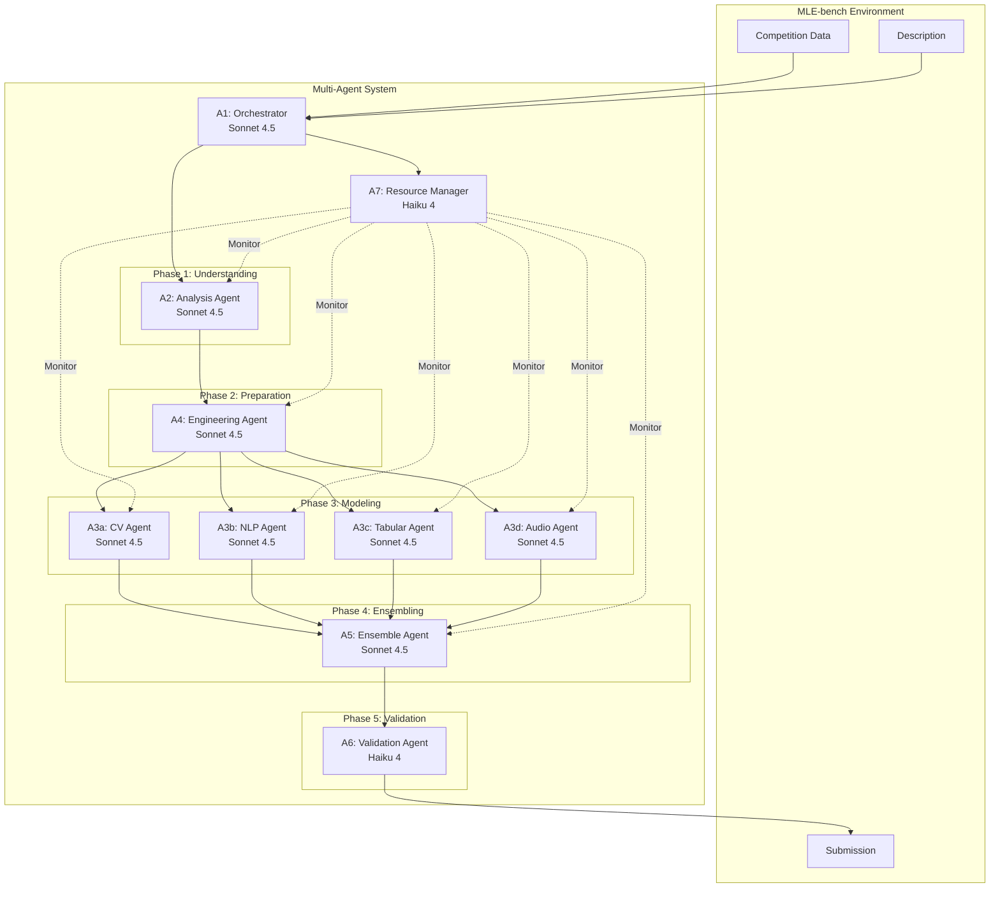

## 2. Agent Hierarchy and Spawning

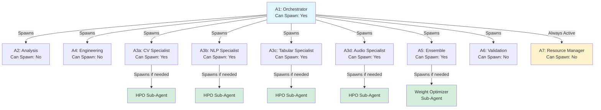

## 3. Plug Architecture

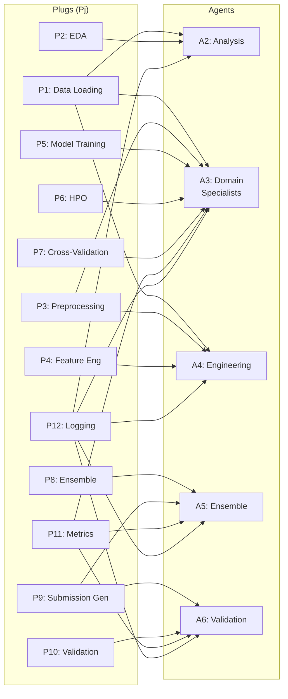

## 4. Data Flow Pipeline

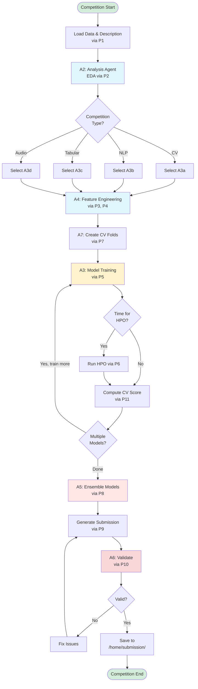

## 5. Communication Pattern

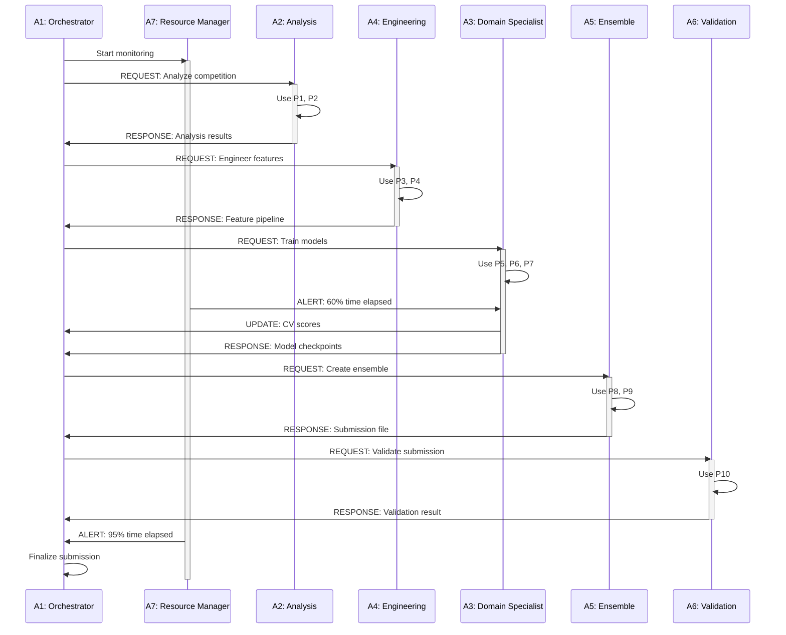

## 6. State Management

```mermaid
graph TD
    subgraph "Shared State Store"
        Global[Global State<br/>Owner: A1]

        subgraph "Agent States"
            S1[A1 State]
            S2[A2 State]
            S3[A3 State]
            S4[A4 State]
            S5[A5 State]
            S6[A6 State]
            S7[A7 State]
        end

        subgraph "Artifacts"
            Data[Data Artifacts]
            Models[Model Checkpoints]
            Preds[Predictions]
            Viz[Visualizations]
        end

        subgraph "History"
            StateHist[State Changes]
            MsgHist[Messages]
            ResHist[Resource Usage]
        end
    end

    A1Agent[A1: Orchestrator] -->|Write| S1
    A1Agent -->|Write| Global
    A1Agent -->|Read| S2
    A1Agent -->|Read| S3

    A2Agent[A2: Analysis] -->|Write| S2
    A2Agent -->|Write| Viz
    A2Agent -->|Read| Data

    A3Agent[A3: Domain] -->|Write| S3
    A3Agent -->|Write| Models
    A3Agent -->|Write| Preds

    A7Agent[A7: Resource Mgr] -->|Write| S7
    A7Agent -->|Write| ResHist
    A7Agent -->|Read All| Global

    style Global fill:#ffe5e5
    style StateHist fill:#d4edda
    style MsgHist fill:#d4edda
    style ResHist fill:#d4edda
```

## 7. Time Budget Allocation

```mermaid
gantt
    title Multi-Agent System Time Budget (24 hours = 100%)
    dateFormat X
    axisFormat %s

    section Phase 1
    Understanding (10%) :p1, 0, 10

    section Phase 2
    Preparation (15%) :p2, 10, 15

    section Phase 3
    Quick Baseline (9%) :p3a, 25, 9
    Advanced Modeling (42%) :p3b, 34, 42
    Final Models (9%) :p3c, 76, 9

    section Phase 4
    Ensembling (10%) :p4, 85, 10

    section Phase 5
    Submission (5%) :p5, 95, 5

    section Continuous
    Resource Monitoring :crit, 0, 100
    Validation :crit, 0, 100
```

## 8. Agent State Machines

### Orchestrator State Machine

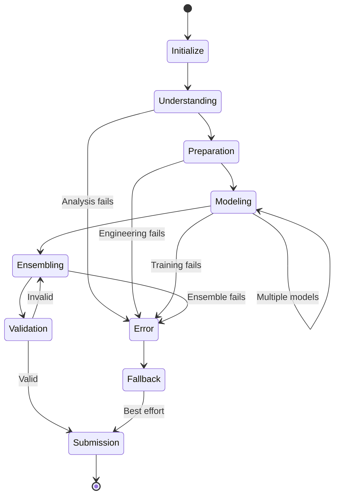

### Domain Specialist State Machine

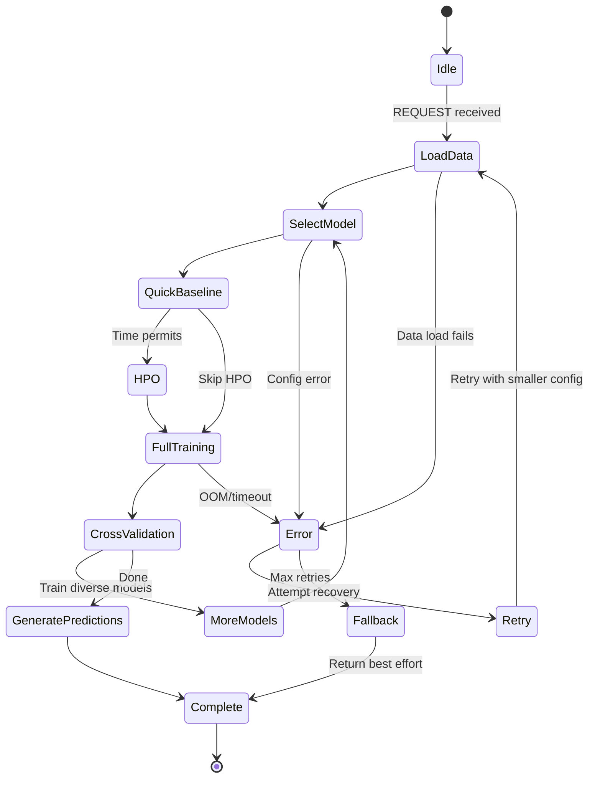

## 9. Plug Interaction Matrix

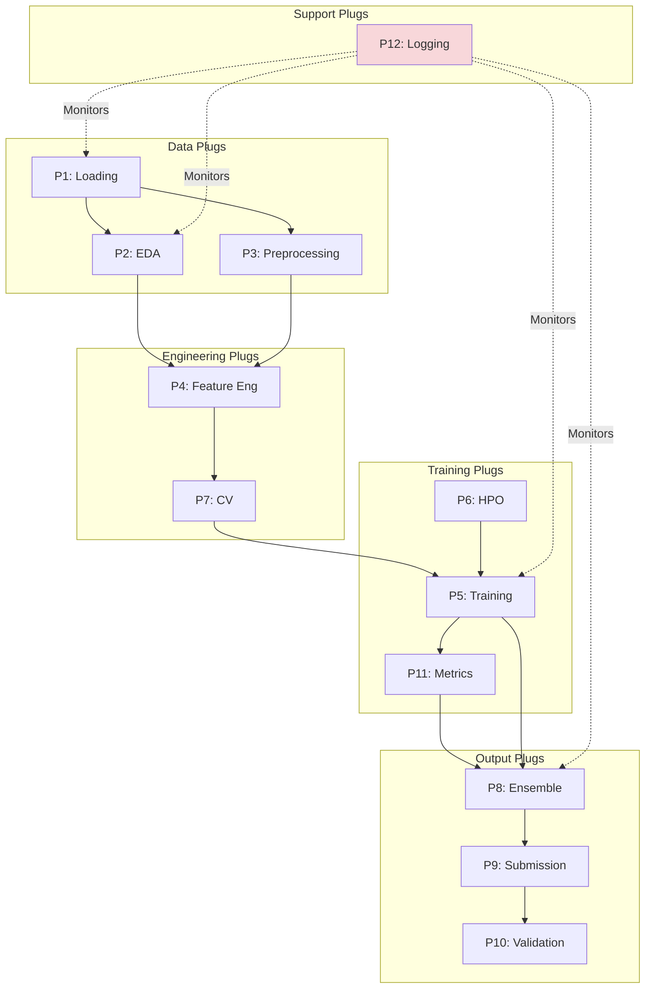

## 10. Error Handling and Recovery

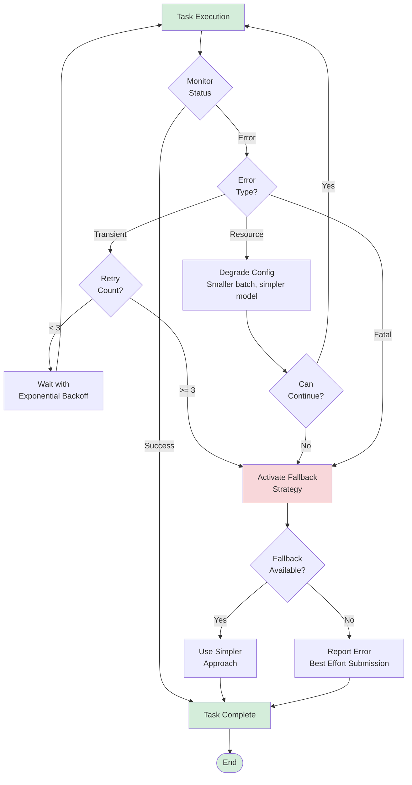

## 11. Resource Monitoring Flow

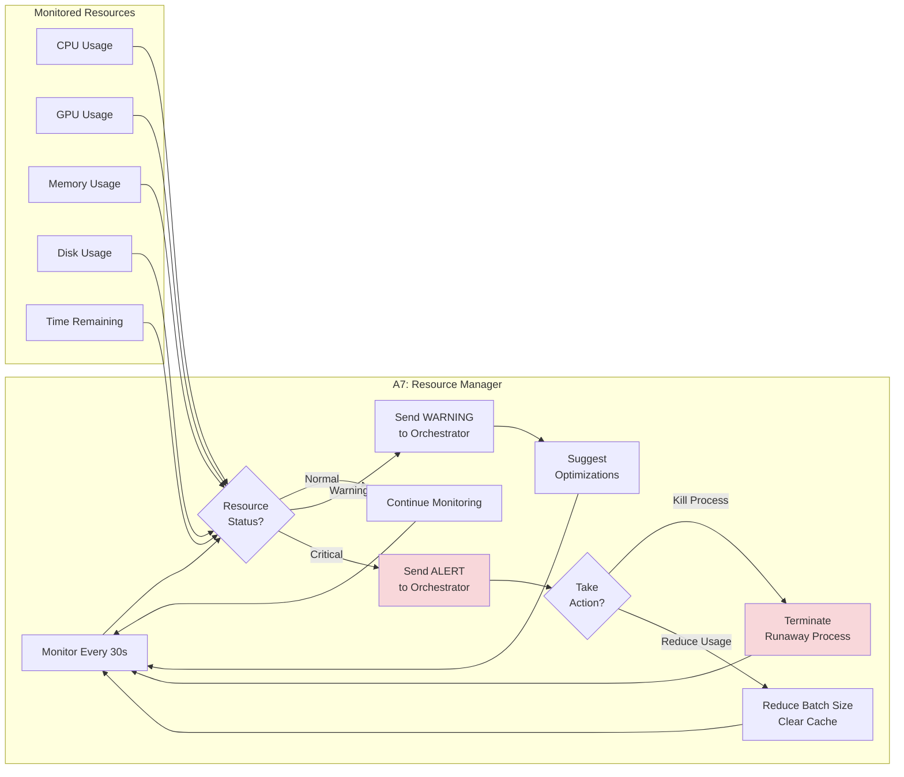

## 12. Ensemble Strategies Decision Tree

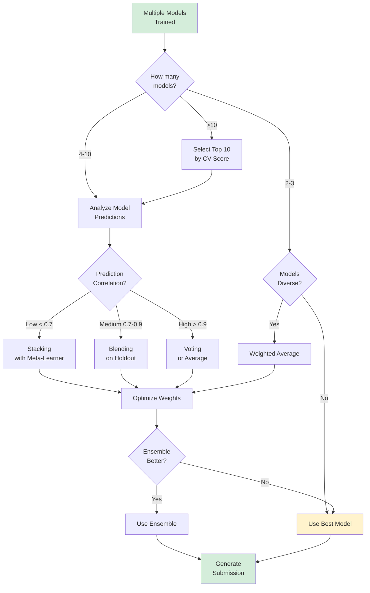

---

## Diagram Conventions

- **Blue boxes**: Primary agents and components
- **Yellow boxes**: Resource management and monitoring
- **Green boxes**: Sub-agents and spawned processes
- **Red/Pink boxes**: Validation, errors, and critical paths
- **Dotted lines**: Monitoring or optional connections
- **Solid lines**: Data flow or command flow
- **Dashed arrows**: Bidirectional communication

---

*These diagrams complement the main design document: `multi_agent_system_design.md`*
